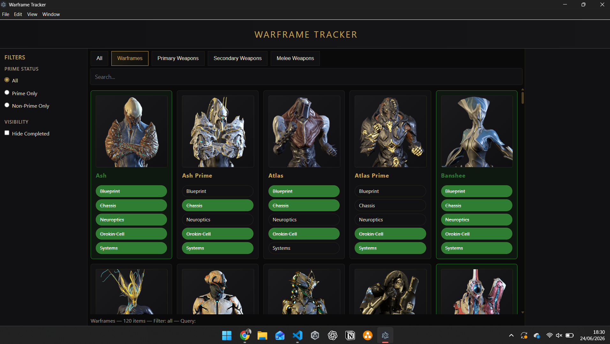

# Warframe Tracker

> A local Warframe progress tracker built for Linux.

## Overview

This application exists for a few reasons: I moved to Linux, couldn't get Alecaframe running without pulling in a pile of extra dependencies, and I'm not a fan of ads. So I built something myself, using a stack I'm comfortable with:

- **Plotly Dash** (Python) for the web app
- **Electron** to host the web app as a standalone desktop application

The app gives a quick overview of every item in Warframe, with filtering options such as "Prime Only" and "Hide Completed".

<p align="center">  </p>

## Limitations

Other trackers (such as AlecaFrame) sit in a gray area when it comes to how they access your Warframe account data — some users have reported being banned as a result.

To avoid this, Warframe Tracker does not access your account data at all. This means progress has to be checked off manually, which is admittedly a bit more tedious, but keeps your account safe.

## Scope

The app organizes items into the following tabs:

- Warframes
- Primary Weapons
- Secondary Weapons
- Melee Weapons

## Running the Application

### Prerequisites

- Python with [`uv`](https://github.com/astral-sh/uv) installed
- Node.js installed

### Installation

**Backend:**

```bash
cd backend
uv sync
```

**Electron:**

```bash
cd electron
npm install
```

### Run

Start the application with:

```bash
npm start --prefix electron
```

#### Debug Mode

You can optionally enable debug mode with a `--debug=true`/`--debug=false` flag (defaults to `false`):

```bash
npm start --prefix electron -- -- --debug=true
```

A couple of details on the syntax:

- The flag must be written as a single token with an equals sign (`--debug=true`), not as two separate arguments (`--debug true`).
- The double `--` is required: the first tells npm to forward the remaining arguments to the underlying `electron .` command, and the second tells Electron to stop parsing flags itself, since `--debug` on its own is a reserved (and deprecated) Node/Electron flag.

Electron reads this flag and forwards it as a command-line argument to the Python backend (`uv run python app.py --debug=true`). When enabled, the Plotly Dash server runs in debug mode (e.g. hot-reloading, verbose error output).

### Behavior

- Electron waits for the Dash server to come up on `localhost`.
- Dash runs as the local UI backend.
- Electron wraps it in a desktop shell.

### Adding as an Application (Linux)

Once the repository is cloned to your local machine, you can register it as a desktop application.

Create the file:

```
~/.local/share/applications/warframe-tracker.desktop
```

With the following contents:

```ini
[Desktop Entry]
Type=Application
Name=Warframe Tracker
Comment=Local tracker for Warframe
Exec=npm start --prefix /full/path/to/your/project/electron
Icon=/full/path/to/your/project/electron/assets/favicon.png
Terminal=false
Categories=Game;Utility
StartupNotify=True
```

Then refresh the desktop database:

```bash
update-desktop-database ~/.local/share/applications
```

Warframe Tracker should now appear in your application launcher.