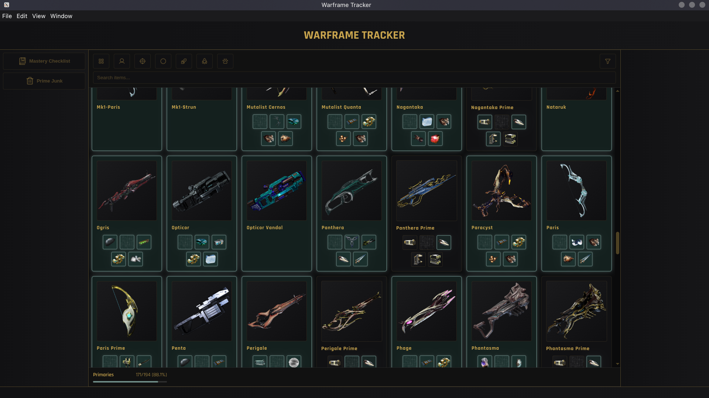
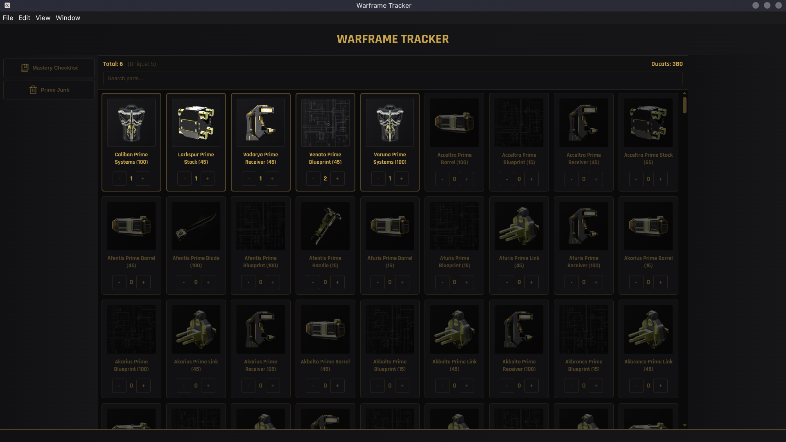

# Warframe Tracker

Track your mastery progress and keep tabs on your Prime parts. A lightweight desktop companion for Warframe enthusiasts who want to stay on top of their grind.



## What It Does

Warframe Tracker helps you manage two key aspects of your Warframe progression:

### Mastery Checklist
Keep track of all the equipment you've mastered across every category:
- Warframes
- Primary Weapons
- Secondary Weapons
- Melee Weapons
- Archwings
- Companions

Never lose progress wondering what you've already leveled. The app remembers exactly where you left off.

### Prime Parts Inventory
Track your Prime parts collection and their ducat values at a glance. Perfect for keeping organized when you're racking up parts for prime vaulted items or just managing your farm haul.



## Getting Started (Users)

### How to Run

Since this is still in pre-release, you'll need to run it as a development build. Head over to the [developer setup section](#for-developers) below and follow the instructions to clone, install dependencies, and start the dev server.

### Usage

**Mastery Tracker:**
- Click on any item to check it off as mastered
- Use the filters to focus on specific weapon types
- Right-click for quick actions like "Mark All Complete"

**Prime Parts:**
- Add parts as you collect them
- Track ducat values for each component
- Search to find specific parts quickly

All your progress is saved automatically and synced between sessions.

## For Developers

Want to contribute or just get it running? Here's how to set up the project.

### Prerequisites

- **Node.js** 18+ (LTS recommended)
- **npm** or **yarn**
- **Linux** with X11 support

### Setup & Running

1. **Clone the repository**
   ```bash
   git clone https://github.com/yourusername/warframe-tracker.git
   cd warframe-tracker
   ```

2. **Install dependencies**
   ```bash
   npm install
   ```

3. **Start the development server**
   ```bash
   npm run dev
   ```

The app will launch in development mode with hot reload enabled. Any changes to the code will automatically refresh the window.

### Desktop Integration (Optional)

To add Warframe Tracker to your applications menu, create a desktop entry:

```bash
mkdir -p ~/.local/share/applications
cat > ~/.local/share/applications/warframe-tracker.desktop << EOF
[Desktop Entry]
Type=Application
Name=Warframe Tracker
Comment=Track your Warframe mastery and Prime parts
Exec=npm run dev --prefix /path/to/warframe-tracker
Icon=gamepad
Terminal=false
Categories=Utility;Games;
EOF
```

Replace `/path/to/warframe-tracker` with the full path to your project directory. Your application launcher will now show Warframe Tracker.

### Project Structure

```
warframe-tracker/
├── electron/           # Electron main process & IPC handlers
│   ├── main.ts         # App initialization, window setup, data storage
│   ├── preload.ts      # IPC bridge for renderer process
│   └── assets/         # Electron-specific resources
├── src/                # React frontend
│   ├── views/          # Main app views (Mastery Tracker, Prime Junk)
│   ├── components/     # Reusable UI components
│   ├── layout/         # App layout structure
│   ├── types/          # TypeScript types
│   └── App.tsx         # Root app component
├── electron.vite.config.ts  # Build configuration
└── tsconfig.json       # TypeScript configuration
```

### Tech Stack

- **Electron** – Desktop framework
- **React** – UI library
- **TypeScript** – Type safety
- **Vite** – Build tool
- **@wfcd/items** – Warframe game items database
- **electron-store** – Local data persistence
- **Framer Motion** – Smooth animations
- **phosphor-react** – Icon library

### Key Files to Know

- [main.ts](./electron/main.ts) – Handles IPC communication and data persistence
- [App.tsx](./src/App.tsx) – Root component and view management
- [MasteryTracker.tsx](./src/views/MasteryTracker.tsx) – Mastery progress tracking logic
- [PrimeJunk.tsx](./src/views/PrimeJunk.tsx) – Prime parts inventory logic

### Development Tips

- **Data is persisted** using `electron-store` (typically located at `~/.config/warframe-tracker/` on Linux)
- **IPC handlers** in `main.ts` bridge the React frontend with Electron backend
- **Items data** is fetched from `@wfcd/items` and cached for performance
- The app uses a **three-panel layout**: navigation (left), content (center), and info panel (right)

### Troubleshooting

**App won't start in development:**
```bash
# Try clearing the Vite cache and reinstalling
rm -rf node_modules/.vite
npm install
npm run dev
```

**X11 display issues on WSL/remote environments:**
The dev command includes `--ozone-platform=x11` to ensure compatibility. Make sure your `DISPLAY` variable is set correctly.

---

**Have questions or want to contribute?** Feel free to open an issue or submit a pull request!

Happy tracking, Tenno.
